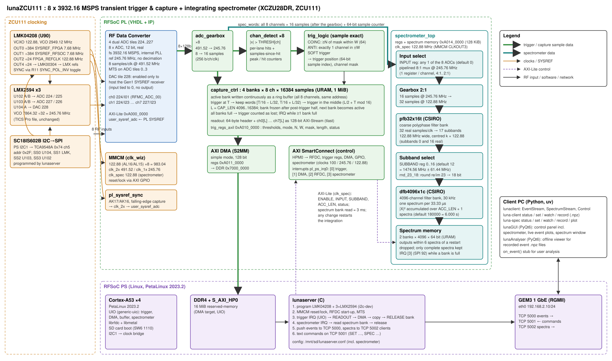

# lunaZCU111 – 8-channel 3.93 GS/s transient trigger and capture on the ZCU111

This design uses the ZCU111 (XCZU28DR RFSoC) to digitise 8 RF inputs at **3932.16 MSPS** (ADC PLLs referenced to 245.76 MHz, multi-tile synchronised). The PL checks every sample on every channel against its own programmable threshold. The trigger is either **N-of-8 coincidence** or **anti-coincidence** within a sample-exact window (default 64 samples). When it fires, **16384 samples** (programmable down to 4096) are captured on all 8 channels at the same time, with the trigger in the middle of the buffer. A server on the PS (Linux) gets an interrupt, reads each event by DMA and streams it over 1 GbE to clients. Thresholds and the rest of the configuration are set over the same link.



The Vivado block design itself is in `docs/vivado_bd.svg` / `docs/vivado_bd.pdf`, generated by `hw/scripts/build_bd.tcl`.

**Status (2026-10-02): working on hardware and collecting data.**
- All VHDL simulations pass.
- The full build meets timing: WNS +0.109 ns, WHS +0.010 ns, PL SYSREF capture +0.46/+1.47 ns.
- Utilisation: 5.8 % LUTs, 32/80 URAM, 4 BRAM.
- PetaLinux 2023.2 images are built (`sw/petalinux/setup.sh`; the root file system is inside `image.ub`).
- The ZCU111 boots from the SD card through the FSBL (which loads the bitstream) and U-Boot to Linux. U-Boot needed `CONFIG_SYS_BOOTM_LEN=0x10000000` for the 110 MB kernel + initramfs; `setup.sh` applies this.
- Confirmed working on the board:
  - LMK04208/LMX2594 clock programming by `lunaserver`;
  - RFDC start-up and ADC multi-tile sync;
  - threshold triggering in the PL;
  - DMA readout of captured events;
  - streaming to the network client, which collects event data.
- Harmless console messages: `I/O error, dev mtdblock0` (the unused QSPI flash) and the U-Boot environment/MAC/SATA warnings.

## Contents

| Path | What |
|------|------|
| `hw/hdl/*.vhd` | VHDL: gearbox, detector, trigger logic, capture banks, readout, registers, SYSREF capture |
| `hw/sim/` | xsim testbenches, Python golden model, `run_sim.sh` |
| `hw/scripts/build_bd.tcl` | Vivado block design (PS, RFDC, MMCM, DMA, interconnect, IRQs) |
| `hw/scripts/build.tcl` | unattended build → bitstream + `hw/build/lunaZCU111.xsa` |
| `hw/scripts/export_bd_image.tcl` | exports the Vivado BD picture (GUI mode) |
| `hw/constraints/zcu111.xdc` | PL reference clock and PL SYSREF pins |
| `sw/server/` | `lunaserver` (C): clocks, RFDC/MTS, trigger IRQ, DMA, TCP |
| `sw/client/` | Python client library, `luna-client` CLI stub and `lunaGUI` (PyQt6) control panel/plots (uv project) |
| `sw/petalinux/` | PetaLinux 2023.2 layer (device tree, kernel config, recipe) + `setup.sh` |
| `docs/` | block diagram, register map, network protocol |
| `refernces/` | TICS Pro clock files (as supplied); the ZCU111 user guide and schematic PDFs are not in git, see `refernces/README.md` |

## Tools

| Tool | Status |
|------|--------|
| Vivado / Vitis 2023.2 (`~/Xilinx`) | installed. Licence from `~/Xilinx/license.sh` (XCZU28DR needs an Enterprise licence) |
| aarch64 cross-compiler (Vitis `gnu/aarch64`) | installed |
| Python 3 + numpy, uv | installed |
| PetaLinux 2023.2 | installed (`~/Xilinx/Petalinux/2023.2`; `setup.sh` also looks in `~/Xilinx/PetaLinux/2023.2`). ZCU111 BSP: `~/Xilinx/xilinx-zcu111-v2023.2-10140544.bsp` |
| PetaLinux host packages | `sudo apt install gcc-multilib libncurses-dev texinfo libtool-bin xterm net-tools pax diffstat chrpath socat bc python3-pip` and `sudo dpkg-reconfigure dash` → **No** (`/bin/sh` must be bash) |

Keep Vivado parallelism at 2–4 jobs. More jobs run out of memory on this 16 GB WSL2 machine.

## Build

```bash
# 1. VHDL unit simulations (≈2 min)
hw/sim/run_sim.sh

# 2. FPGA: block design, synthesis, implementation, bitstream, XSA (about 1 h)
source ~/Xilinx/license.sh
cd hw/build && vivado -mode batch -source ../scripts/build.tcl -tclargs all 3
#   -> hw/build/lunaZCU111.xsa, lunaZCU111.bit, timing_summary.rpt
#   optional picture of the Vivado BD (opens a window briefly):
vivado -mode gui -source ../scripts/export_bd_image.tcl

# 3. Linux (after installing PetaLinux 2023.2; optionally pass the ZCU111 BSP)
sw/petalinux/setup.sh [--bsp ~/Downloads/xilinx-zcu111-v2023.2-final.bsp]
#   -> copy BOOT.BIN, image.ub, boot.scr to the SD card FAT partition
#      (a copy is kept in sw/petalinux/sd_card/; build_images.sh rebuilds an existing project)
#   ZCU111 SW6[4:1] = OFF,OFF,OFF,ON  (SD boot, UG1271 table 2-4)

# 4. Client (on the remote PC, host on 192.168.2.0/24)
cd sw/client && uv sync
uv run luna-client status
uv run luna-client set --thresh 8000 --mode coinc --n 2 --window 64 --mask 0xff --len 16384 --save
uv run luna-client record -o data/        # saves events as .npz
```

To test the server and client without hardware (on any Linux PC):

```bash
cd sw/server && make host && ./lunaserver-host -s 10 -c /tmp/luna.conf   # 10 synthetic events/s
cd sw/client && LUNA_HOST=127.0.0.1 uv run luna-client watch
```

## Versions and development

- **Releases** are git tags. Each one has a GitHub release with the SD card images (`BOOT.BIN`, `image.ub`, `boot.scr`), the XSA, the bitstream and the timing/utilisation reports, because build outputs are not tracked in git.
  - `v1.0`: first working hardware release (firmware VERSION 1.0, protocol version 1).
- **New features** are developed on a branch checked out in its own folder with `git worktree`, so the released design stays built and bootable alongside them:

  ```bash
  git worktree add -b <feature> ../lunaZCU111-<feature>   # new folder on a new branch
  git worktree list
  git worktree remove ../lunaZCU111-<feature>             # after merging into main
  ```

  Each worktree has its own `hw/build/` and PetaLinux project. `setup.sh` points all of them at one shared download/sstate cache (`~/Xilinx/plnx-cache`, override with `PLNX_CACHE`), so a second PetaLinux build reuses the first one's results. Run only one Vivado or PetaLinux build at a time on this 16 GB machine.
- **Block design changes** must go into `hw/scripts/build_bd.tcl` (edit it, or `write_bd_tcl` after GUI changes). The Vivado project in `hw/build/` is regenerated and is not in git.
- **Version numbers:** bump the firmware `VERSION` register (`trig_regs_axil.vhd`, major.minor) and `LUNA_PROTO_VERSION` (`protocol.h`) when the register map or network frames change, so mismatched firmware, server and client are detected.

## Design notes

**Clocks** (taken from `refernces/`, UG1271 and schematic 0381811):
- LMK04208 U90, VCO 2949.12 MHz:
  - OUT0 ÷384 → **PL SYSREF 7.68 MHz** (AK17/AK16)
  - OUT1 ÷384 → **analog SYSREF** (DAC tile 228 pins)
  - OUT2 ÷24 → **PL reference 122.88 MHz** (AL16/AL15)
  - OUT4 → LMX2594 references
- The stock TICS Pro file runs every output at 122.88 MHz. `sw/server/gen_clk_tables.py` changes only the OUT0/OUT1 dividers. The server then issues a SYNC so that the SYSREF edges are phase-aligned with the 122.88 MHz outputs.
- LMX2594 ×3: the supplied 245.76 MHz file, unchanged.
- Everything is programmed by `lunaserver` through PS I2C1 → TCA9548A (0x74) port 5 → SC18IS602B (0x2F).

**RFDC:**
- 4 dual ADC tiles, real input, 1× decimation, 8 samples per 491.52 MHz clock. 8 samples per clock is the IP maximum, so the RFDC interface must run at 491.52 MHz.
- The data is immediately regrouped to 16 samples at 245.76 MHz. All trigger and capture logic runs at 245.76 MHz.
- **DAC tile 228 is enabled but unused.** The Gen1 driver runs the SYSREF master through DAC tile 0 even for ADC-only MTS (`xrfdc_mts.c`). Its input is tied to zero, and nothing is connected to its output.

**Trigger:**
- Every sample is compared (|x| > threshold, per channel).
- Per lane, the detector also tracks the number of samples since the last hit. This makes the window test exact at the sample level, across clock-cycle boundaries.
- The definitions are in `docs/protocol.md` and `hw/hdl/trig_logic.vhd`. They are verified against a brute-force Python model on 22 configurations: N=1..8, windows 1–255, masks, anti-coincidence.

**Capture:**
- 4 banks × 8 channels × 16384 × 16 bit in UltraRAM (32 of 80 URAMs).
- The next event can be captured while earlier ones are being read. The only dead time is L/2 samples of pre-trigger refill (2.1 µs at L = 16384). When all 4 banks are waiting, triggers are counted in `LOST_COUNT`.

**Readout:**
- Readout is DMA to a 16 MiB reserved DDR region, then copied to RAM and the bank is released.
- Network sending is asynchronous, with a per-client queue. A slow client loses frames; the capture is never blocked.
- One 16384-sample event is 256 KiB, so 1 GbE carries about 400 events/s.

## Bring-up checklist

1. Boot and `ping 192.168.2.10`. The serial console is on the USB-UART (J83), 115200 baud.
2. `journalctl -u lunaserver` (or `/var/log/lunaserver.log`) should show:
   - clocks programmed;
   - MMCM locked;
   - 4 ADC tiles PLL-locked at 3932.160 MHz;
   - `ADC multi-tile sync OK` with the per-tile latencies.

   The LEDs DS34/DS35/DS44 (LMX lock) and DS45 (LMK) should be on.
3. `luna-client status`: `sysref` must increase at 7.68 MHz between two calls, and `rfdc=up mts=ok`.
4. With no inputs, run `luna-client cmd "GET PEAKS"` to see the noise level. Set the thresholds a few times above it.
5. Run `luna-client cmd SOFTTRIG`, then `luna-client watch`. You should get an event with src `soft`.
6. Split one pulse (a few ns long) to all 8 inputs. The events should show the pulse at the same sample on every channel (MTS alignment) and at `trig_offset`. Check `N` and anti-coincidence with subsets of the channels.

## Troubleshooting and performance notes

These were the open items before bring-up; the design now works on hardware, but they are the places to look if a rebuild or a new board misbehaves.


- **LMK04208 SYNC:**
  - The ÷384 SYSREF outputs are aligned by toggling SYNC_POL_INV.
  - If MTS reports `PL SysRef may not have been captured synchronously`, adjust the SYSREF input delay: either the capture edge in `pl_sysref_sync.vhd`, or the LMK CLKout0 digital/analog delay.
- **DMA copy speed:**
  - The DMA buffer is mapped uncached through UIO, and copied with aligned 16-byte loads.
  - If a higher event rate is needed, switch to `u-dma-buf` (cached with sync) or read directly into socket buffers.
- **Device-tree labels:**
  - `system-user.dtsi` refers to the generated labels `trigger_capture`, `dma` and `mmcm_gpio`, and to the node `dma-channel@a0110030`.
  - If `petalinux-build` stops at a label error, check `components/plnx_workspace/device-tree/device-tree/pl.dtsi` and fix the names.
